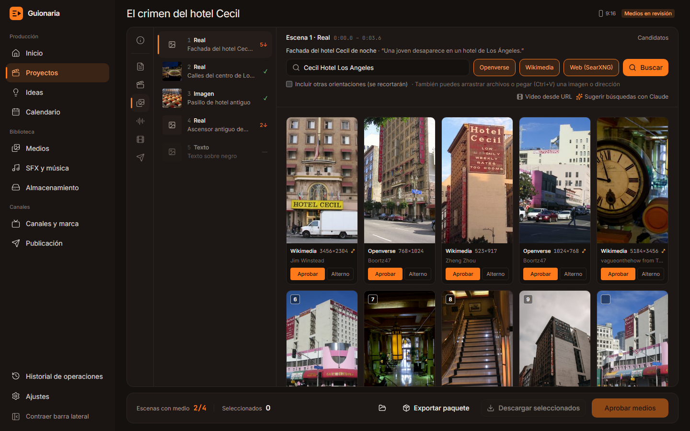

# Guionaria

**De la idea al video listo para editar.** Guionaria es una aplicación de escritorio local y 100 % gratuita para producir videos y reels. Claude escribe el guion y arma la tabla de escenas, y la app busca, descarga, nombra y organiza los medios de cada escena. Todo queda en carpetas listas para editar en DaVinci Resolve o cualquier editor.



> Todas las capturas son de la app real, con datos de demostración. Las fotos de la pantalla de medios son resultados reales de Wikimedia Commons y Openverse, con sus licencias.

---

## Cómo funciona

```
Idea ─▶ Guion (Claude) ─▶ Escenas (Claude) ─▶ Medios por escena ─▶ Voz ─▶ Timeline ─▶ Publicación
          aprobar            aprobar           buscar · descargar
                                               aprobar
```

1. **Canal:** tono, plataformas, estructura del guion y velocidad de narración.
2. **Proyecto:** Video 16:9 o Reel 9:16. El formato define la orientación de todos los medios.
3. **Guion:** Claude lo escribe con tus notas y el estilo del canal; tú lo corriges en el editor y lo apruebas.
4. **Escenas:** Claude convierte el guion en una tabla (tipo de medio, descripción visual, búsquedas, efecto, texto en pantalla, SFX, música). Los tiempos los calcula la app.
5. **Medios:** búsqueda por escena en bancos gratuitos y material real, descarga, aprobación y nombres automáticos.
6. **Paquete:** guion, tabla de escenas, créditos y un LEEME con qué va en cada escena.

Cada etapa tiene estado *borrador → revisión → aprobado*. Si cambias un segmento del guion, solo sus escenas quedan para revisar; el resto se conserva.

---

## Estado del proyecto

| Fase | Contenido | Estado |
|---|---|---|
| **0 — Base** | Tauri + React, núcleo Python como sidecar, tema y layout, SQLite + migraciones, verificación de dependencias | ✅ Completa |
| **1 — MVP de producción** | Canales y proyectos · guion con Claude y editor TipTap · tabla de escenas · Pexels y Pixabay · descargas, miniaturas y renombrado · vista grande, arrastrar y soltar, Ctrl+V · paquete del proyecto | ✅ Completa |
| **2A — Material real** | SearXNG, Wikimedia Commons, Openverse, Unsplash · video desde URL con yt-dlp (con fragmento) | ✅ Completa |
| **2B — Voz y tiempos** | TTS local (Piper) o voz grabada · Whisper para tiempos reales · SRT/VTT | ✅ Completa |
| 2C — Timeline | Exportar a OTIO, FCPXML (DaVinci Resolve) y EDL | ⏳ Siguiente |
| 2D — MCP | Servidor MCP para usar Guionaria desde Claude Desktop y Claude Code | ⏳ |
| 2E — Encuadre | Zona visible en 16:9 o 9:16 y tramo del clip | ⏳ |
| 3 — Organización | Biblioteca global, almacenamiento, calendario, ideas, historial | ⏳ |
| 4 / 5 | Render automático · publicación y analítica | ⏳ |

La especificación completa está en [SPEC.md](SPEC.md).

---

## Pantallas

### Inicio y proyectos

Proyectos pendientes ordenados por fecha de publicación, en naranja los de este mes. El selector de canal del encabezado filtra todo y muestra el avance del mes.


La tabla de proyectos tiene pestañas por etapa con contadores y búsqueda de texto completo (título, tema, etiquetas y texto del guion).


Al crear un proyecto eliges **Video 16:9** o **Reel 9:16**, el canal, el tema, tus notas de investigación, la duración y la fecha objetivo.


### Guion

Editor TipTap por segmentos:
- duración estimada de cada frase en el margen y etiquetas de sección;
- **datos por verificar** subrayados: Claude los marca cuando no están en tus notas;
- al seleccionar texto: **Reescribir con Claude** (instrucción libre, "más corto", "más dramático"), con la propuesta marcada para aceptar o descartar;
- **versiones** con comparación palabra por palabra y restauración;
- `Ctrl+S` guarda y `Ctrl+Enter` aprueba.


### Escenas

Tabla editable con clic en cada celda, arrastre para reordenar, dividir, duplicar y eliminar, y pestañas por tipo. Claude la genera con las reglas de la spec: búsqueda en inglés para stock, búsqueda de material real, efectos permitidos y todos los segmentos cubiertos. Si cambias el guion, **Regenerar pendientes** rehace solo las escenas afectadas. Exporta a Markdown y CSV.


### Medios

Lista de escenas a la izquierda; búsqueda y galería a la derecha (imagen principal de este README).
- Fuentes según el tipo de escena: stock para video e imagen; web, Wikimedia y Openverse para **material real**.
- Selección múltiple (clic o teclas 1–9), descarga en segundo plano con reintentos, **vista grande** con Espacio.
- **Aprobar** o **Alterno**: el archivo se copia a `media/approved/` con el nombre de la convención y se renombra solo si cambian el orden o los tiempos.
- **Arrastra** archivos del explorador o **pega (Ctrl+V)** una imagen o una dirección. Soltar sobre una descarga fallida la reemplaza y conserva su autor y licencia.
- **Video desde URL** (YouTube, noticias, redes) con yt-dlp, con opción de bajar solo un fragmento.
- El material sin licencia conocida queda marcado **Derechos: revisar**.
- **Exportar paquete** deja `guion.md`, `escenas.md` y `.csv`, `creditos.txt` y `LEEME.txt` en la carpeta del proyecto.

### Voz

- **Voz generada con Piper**, gratis y sin conexión: eliges la voz en español, la velocidad y la pausa entre segmentos. Cada voz se descarga solo la primera vez.
- Se genera segmento por segmento, así que los **tiempos reales** salen al instante y puedes **regenerar un solo segmento**.
- **Voz grabada:** subes tu audio (WAV, MP3, M4A…) y **Whisper** lo transcribe con tiempos por palabra y lo alinea con el guion, aunque cambies alguna palabra al leer.
- Los tiempos reales reemplazan a los estimados en la tabla de escenas y en los nombres de los archivos aprobados. Se escriben `subs/voz.srt` y `subs/voz.vtt`.
- Forma de onda con los segmentos marcados; clic en un segmento para escucharlo.
- Si cambias el guion después, la voz queda **desactualizada** y las escenas vuelven a los tiempos estimados hasta que la generes o transcribas de nuevo.

### Canales y ajustes


Ajustes: verificación de dependencias con el comando para instalar lo que falte, modelo de Claude y **prompts editables**, carpetas de datos, claves de API gratuitas y preferencias.


---

## Claude sin API key

- Dentro de la app, Guionaria usa **Claude Code CLI en modo headless** con tu suscripción: `claude -p` con salida JSON validada contra un esquema, **sin herramientas** (solo escribe texto) y sin guardar la sesión en tu historial.
- Si la respuesta no cumple el formato, se reintenta una vez con el error.
- Los errores llegan con mensajes claros: CLI no instalada, sesión no iniciada o límite del plan.
- Los prompts (`guion`, `reescribir_segmento`, `escenas`, `busquedas_alternativas`) se pueden editar desde Ajustes.
- Solo Claude: no se usan LLM locales.

## Fuentes de medios

| Fuente | Tipo | Clave | Uso |
|---|---|---|---|
| Pexels | Fotos y videos stock | Gratis | Escenas de video e imagen |
| Pixabay | Fotos y videos stock | Gratis | Escenas de video e imagen |
| Unsplash | Fotos | Gratis | Escenas de imagen |
| Openverse | Imágenes Creative Commons | No | Imagen y material real |
| Wikimedia Commons | Fotos libres (lugares, personas públicas, historia) | No | Material real |
| SearXNG | Imágenes web (metabuscador en Docker) | No | Material real · *Derechos: revisar* |
| yt-dlp | Video desde URL (fragmentos) | No | Material real · *Derechos: revisar* |

Las búsquedas se cachean 24 h y la orientación se filtra según el formato del proyecto.

---

## Instalación

Requisitos: Windows 10/11, Node LTS, Rust (MSVC), [uv](https://docs.astral.sh/uv/), FFmpeg, Claude Code CLI con sesión iniciada, y opcionalmente Docker para SearXNG. La guía paso a paso está en [docs/setup-windows.md](docs/setup-windows.md).

```powershell
winget install OpenJS.NodeJS.LTS Rustlang.Rustup astral-sh.uv Gyan.FFmpeg
npm install
cd core; uv sync; cd ..
npm run dev
```

## Comandos (desde la raíz)

| Comando | Qué hace |
|---|---|
| `npm run dev` | Núcleo con recarga (consola aparte) + app Tauri |
| `npm run core:dev` | Solo el núcleo en `http://127.0.0.1:8765` |
| `npm test` | Todas las pruebas: núcleo (pytest + ruff) y app (vitest) |
| `npm run core:test` · `npm run app:test` | Pruebas por separado |
| `npm run typecheck` | Tipos del frontend |
| `npm run sidecar:build` | Empaqueta el núcleo con PyInstaller (~35 MB) |
| `npm run build` | Sidecar + instalador NSIS |

## Estructura

```
apps/desktop/        App de escritorio: Tauri 2 + React 19 + TypeScript + Tailwind v4 + shadcn/ui
  src/features/      script (TipTap), scenes (TanStack Table + dnd-kit), media (galería, visor, arrastre)
  src-tauri/         Ventana sin bordes, lanza el sidecar y lo cierra al salir
core/                Núcleo: Python 3.12 + FastAPI + SQLModel/SQLite + Alembic (guionaria-core)
  guionaria_core/
    api/             Endpoints REST y WebSocket /ws/jobs
    services/        guion, escenas, medios (proveedores, descargas, yt-dlp), paquete, Claude CLI
    prompts/         Prompts por defecto (se copian a tu carpeta para editarlos)
    migrations/      Esquema de la base de datos
  tests/             Pruebas con Claude y APIs simuladas
scripts/             dev.ps1 y build-sidecar.ps1
docs/                Guía de instalación, capturas y referencias de estilo
```

### Arquitectura

```
┌────────────── Tauri (ventana) ──────────────┐        ┌──────── Núcleo local (sidecar) ────────┐
│ React · TanStack Query · TipTap · dnd-kit   │  HTTP  │ FastAPI 127.0.0.1:8765  ·  /ws/jobs     │
│                                             │◀──────▶│ Cola de trabajos (asyncio) · SQLite     │
└─────────────────────────────────────────────┘   WS   │ Claude CLI · httpx · yt-dlp · FFmpeg    │
                                                       └─────────────────────────────────────────┘
```

- El núcleo escucha solo en localhost. CORS y el WebSocket aceptan únicamente el origen de la app.
- Las tareas largas (generar guion o escenas, descargas, video desde URL) corren en segundo plano y la app ve su progreso en vivo.
- En release, la app lanza el núcleo empaquetado y este se cierra solo cuando la app termina.

## Tus datos

Todo vive en `%USERPROFILE%\Guionaria`, fuera del repo; se puede cambiar con la variable `GUIONARIA_HOME`.

```
Guionaria/
├── guionaria.db                 base de datos (proyectos, versiones, escenas, medios)
├── config/settings.json         ajustes y claves de API (solo en tu equipo)
├── config/prompts/*.md          prompts editables
├── models/piper · models/whisper   voces y modelo de Whisper (se descargan la primera vez)
└── channels/<canal>/projects/2026-09-30_el-crimen-del-hotel-cecil_reel/
    ├── guion.md · escenas.md · escenas.csv · escenas.json · creditos.txt · LEEME.txt
    ├── audio/voz.wav · audio/segments/seg_001.wav …
    ├── subs/voz.srt · subs/voz.vtt
    └── media/
        ├── approved/   001_0000_real_cecil-hotel-los-angeles.jpg   ← {escena}_{inicio}_{tipo}_{slug}
        ├── candidates/ 001_wikimedia_12345.jpg
        └── manual/     003_manual_noticia-el-caso.mp4
```

## Pruebas

- **282 pruebas automáticas:** 197 del núcleo y 85 de la app.
- Nunca llaman a la CLI real de Claude ni a internet: Claude, las APIs, las descargas, Piper y Whisper se simulan.
- Hay pruebas con archivos reales: imágenes generadas con Pillow y videos con FFmpeg.
- Cada entrega se validó además con llamadas reales:
  - guiones y escenas con Claude;
  - búsquedas en Wikimedia y Openverse;
  - un fragmento de YouTube con yt-dlp;
  - importación desde una página web;
  - voz real con Piper y transcripción con Whisper, también desde el sidecar empaquetado.

## Derechos y responsabilidad

- Cada medio guarda su origen, autor y licencia; `creditos.txt` los reúne y propone el texto para la descripción del video.
- El material real (fotos de personas, noticias, fragmentos de video) queda marcado **Derechos: revisar**: úsalo en tramos cortos, con comentario y citando la fuente.
- SearXNG y yt-dlp son para uso personal y editorial; la responsabilidad del uso final es de quien publica.
