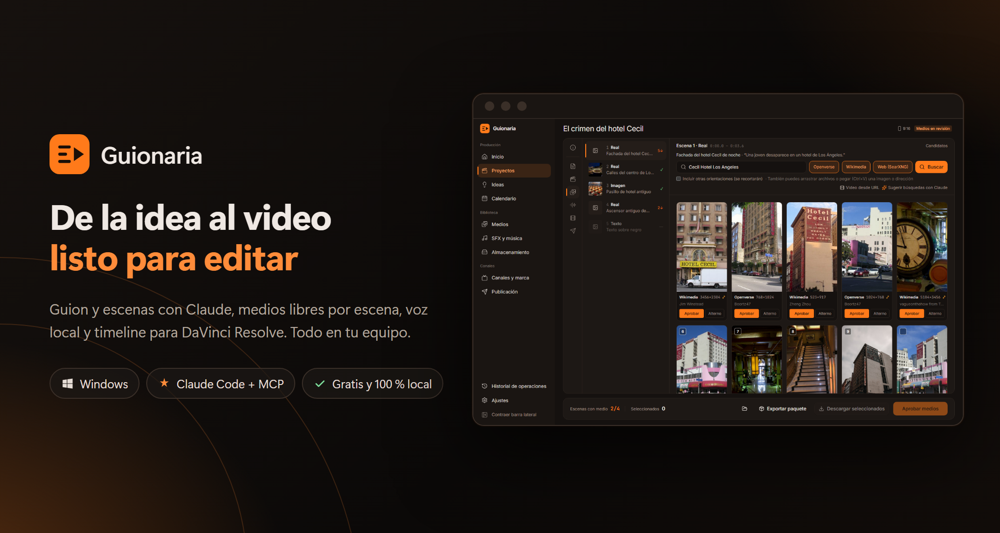
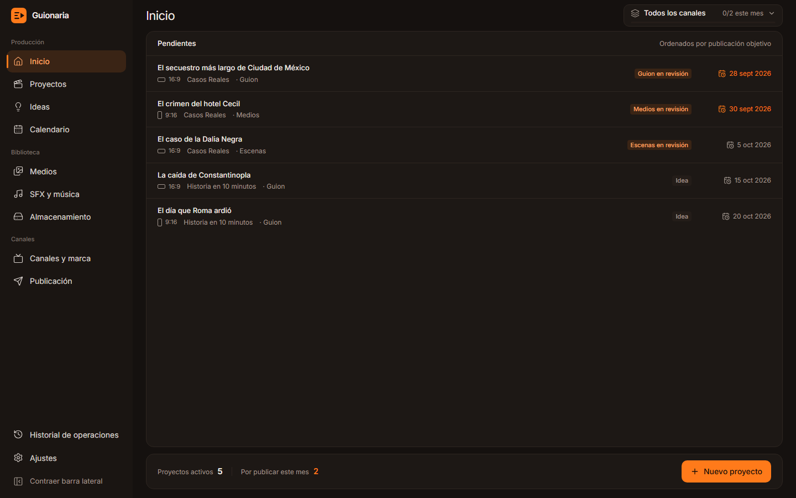
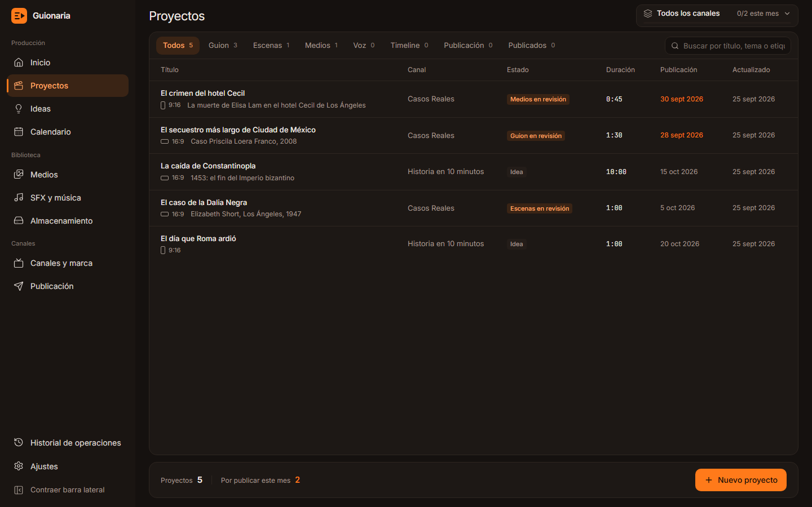
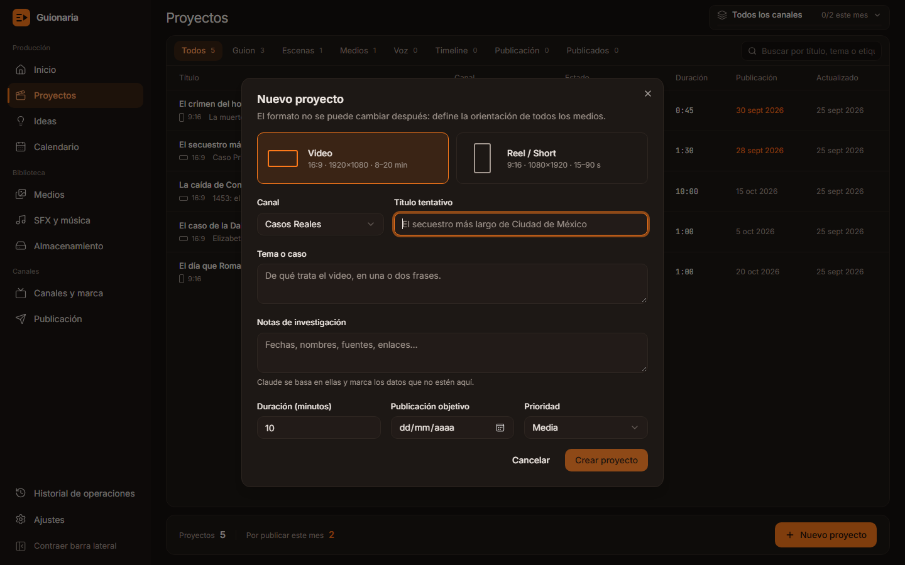
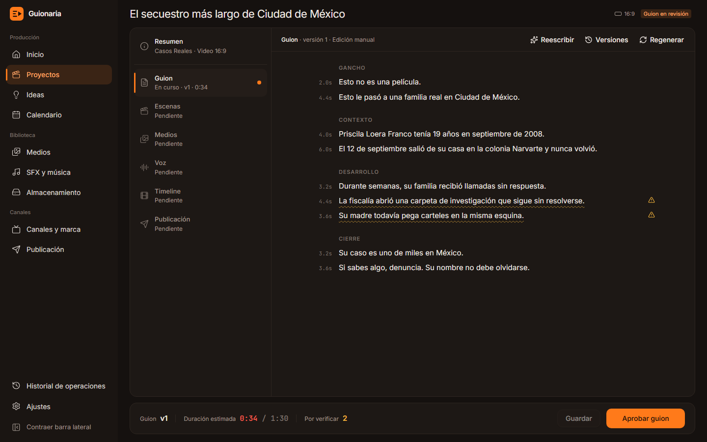
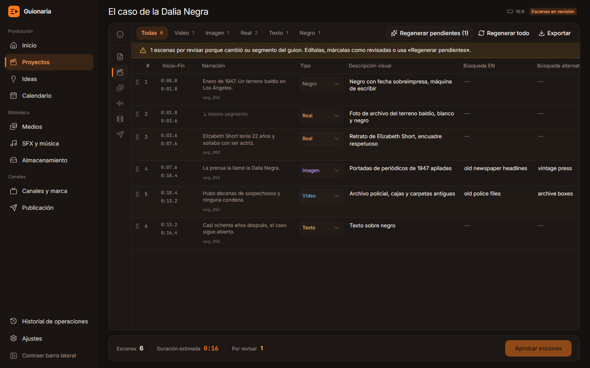
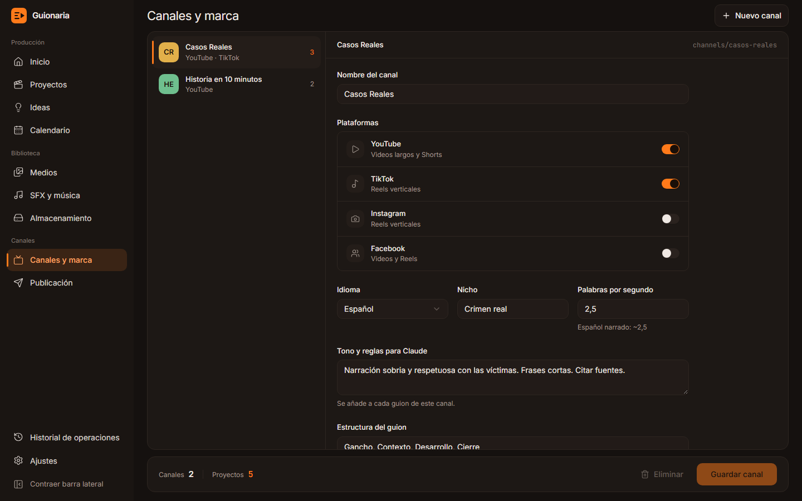
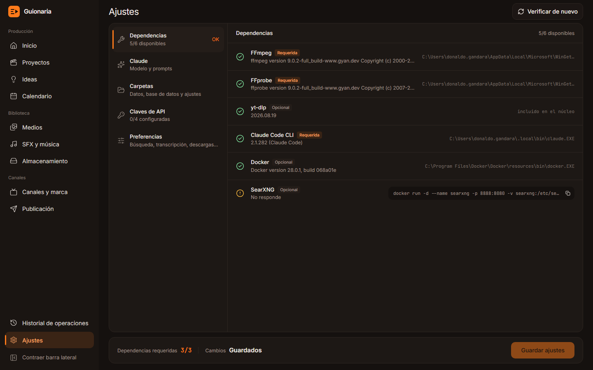

<h1 align="center">
  &nbsp;Guionaria
</h1>

<p align="center">
  Producción de videos y reels, de la idea al timeline, para <b>YouTube</b>, <b>TikTok</b>, <b>Instagram</b> y <b>Facebook</b>
</p>

<p align="center">
  <a href="#características">Características</a> ·
  <a href="#pantallas">Pantallas</a> ·
  <a href="#claude-sin-api-key">Claude y MCP</a> ·
  <a href="#instalación">Instalación</a> ·
  <a href="#arquitectura">Arquitectura</a> ·
  <a href="SPEC.md">Especificación</a>
</p>

<p align="center">
  
  
  
  
  
  
  
</p>

<p align="center">
  
</p>

**Guionaria** es una aplicación de escritorio local y 100 % gratuita. Claude escribe el guion y arma la tabla de escenas; la app busca, descarga, nombra y encuadra los medios de cada escena, genera la voz, calcula los tiempos reales y exporta el timeline para DaVinci Resolve o cualquier editor.

> Todas las capturas son de la app real, con datos de demostración. Las fotos de la pantalla de medios son resultados reales de Wikimedia Commons y Openverse, con sus licencias.

## Características

| Función | Qué hace |
|---|---|
| ✍️ **Guion con Claude** | Escrito con tus notas y el estilo del canal, en un editor por segmentos con versiones y reescritura asistida. |
| 🎬 **Tabla de escenas** | Tipo de medio, descripción visual, búsquedas, efectos, texto en pantalla, SFX y música por escena. |
| 🖼️ **Medios por escena** | Pexels, Pixabay, Unsplash, Openverse, Wikimedia, SearXNG y video desde URL, con autor y licencia. |
| 🎙️ **Voz y tiempos reales** | Voz local con Piper o tu grabación transcrita con Whisper, más subtítulos SRT y VTT. |
| 🎞️ **Timeline exportable** | OTIO, FCPXML y EDL con un marcador por escena, listos para DaVinci Resolve. |
| 🤖 **Claude sin API key** | Usa tu plan de Claude Code; también se controla desde Claude por MCP. |
| 🗓️ **Planificación** | Banco de ideas, calendario, tablero por etapa y recordatorios. |
| 🔒 **Todo en tu equipo** | Núcleo solo en localhost, datos en tu carpeta y solo herramientas gratuitas. |

---

## Cómo funciona

```
Idea ─▶ Guion (Claude) ─▶ Escenas (Claude) ─▶ Medios por escena ─▶ Voz ─────────▶ Timeline ─▶ Editor
          aprobar            aprobar           buscar · descargar    Piper o         OTIO · FCPXML
                                               encuadrar · aprobar   grabación       EDL
```

1. **Canal:** tono, plataformas, estructura del guion y velocidad de narración.
2. **Proyecto:** Video 16:9 o Reel 9:16. El formato define la orientación de todos los medios.
3. **Guion:** Claude lo escribe con tus notas y el estilo del canal; tú lo corriges en el editor y lo apruebas.
4. **Escenas:** Claude convierte el guion en una tabla (tipo de medio, descripción visual, búsquedas, efecto, texto en pantalla, SFX, música). Los tiempos los calcula la app.
5. **Medios:** búsqueda por escena en bancos gratuitos y material real, descarga, aprobación, encuadre y nombres automáticos.
6. **Voz:** generada con Piper o grabada por ti; los tiempos reales reemplazan a los estimados.
7. **Timeline:** OTIO, FCPXML y EDL para el editor, junto con guion, escenas, créditos, subtítulos y un LEEME.

Cada etapa tiene estado *borrador → revisión → aprobado*. Si cambias un segmento del guion, solo sus escenas quedan para revisar; el resto se conserva.

---

## Estado del proyecto

| Fase | Contenido | Estado |
|---|---|---|
| **0 — Base** | Tauri + React, núcleo Python como sidecar, tema y layout, SQLite + migraciones, verificación de dependencias | ✅ Completa |
| **1 — MVP de producción** | Canales y proyectos · guion con Claude y editor TipTap · tabla de escenas · Pexels y Pixabay · descargas, miniaturas y renombrado · vista grande, arrastrar y soltar, Ctrl+V · paquete del proyecto | ✅ Completa |
| **2A — Material real** | SearXNG, Wikimedia Commons, Openverse, Unsplash · video desde URL con yt-dlp (con fragmento) | ✅ Completa |
| **2B — Voz y tiempos** | TTS local (Piper) o voz grabada · Whisper para tiempos reales · SRT/VTT | ✅ Completa |
| **2C — Timeline** | Exportar a OTIO, FCPXML (DaVinci Resolve) y EDL | ✅ Completa |
| **2D — MCP** | Servidor MCP para usar Guionaria desde Claude Desktop y Claude Code | ✅ Completa |
| **2E — Encuadre** | Zona visible en 16:9 o 9:16 y tramo del clip | ✅ Completa |
| **3A — Planificación** | Banco de ideas · calendario mensual y semanal · tablero kanban · recordatorios | ✅ Completa |
| 3B–3E — Organización | Biblioteca global · almacenamiento · historial y papelera · SFX y música | ⏳ Siguiente |
| 4 / 5 | Render automático · publicación y analítica | ⏳ |

La especificación completa está en [SPEC.md](SPEC.md).

---

## Pantallas

### Inicio y proyectos

Proyectos pendientes ordenados por fecha de publicación, en naranja los de este mes. El selector de canal del encabezado filtra todo y muestra el avance del mes.



La tabla de proyectos tiene pestañas por etapa con contadores y búsqueda de texto completo (título, tema, etiquetas y texto del guion).



Al crear un proyecto eliges **Video 16:9** o **Reel 9:16**, el canal, el tema, tus notas de investigación, la duración y la fecha objetivo.



### Guion

Editor TipTap por segmentos:
- duración estimada de cada frase en el margen y etiquetas de sección;
- **datos por verificar** subrayados: Claude los marca cuando no están en tus notas;
- al seleccionar texto: **Reescribir con Claude** (instrucción libre, "más corto", "más dramático"), con la propuesta marcada para aceptar o descartar;
- **versiones** con comparación palabra por palabra y restauración;
- `Ctrl+S` guarda y `Ctrl+Enter` aprueba.



### Escenas

Tabla editable con clic en cada celda, arrastre para reordenar, dividir, duplicar y eliminar, y pestañas por tipo. Claude la genera con las reglas de la spec: búsqueda en inglés para stock, búsqueda de material real, efectos permitidos y todos los segmentos cubiertos. Si cambias el guion, **Regenerar pendientes** rehace solo las escenas afectadas. Exporta a Markdown y CSV.



### Medios

Lista de escenas a la izquierda; búsqueda y galería a la derecha (imagen principal de este README).
- Fuentes según el tipo de escena: stock para video e imagen; web, Wikimedia y Openverse para **material real**.
- Selección múltiple (clic o teclas 1–9), descarga en segundo plano con reintentos, **vista grande** con Espacio.
- **Aprobar** o **Alterno**: el archivo se copia a `media/approved/` con el nombre de la convención y se renombra solo si cambian el orden o los tiempos.
- **Arrastra** archivos del explorador o **pega (Ctrl+V)** una imagen o una dirección. Soltar sobre una descarga fallida la reemplaza y conserva su autor y licencia.
- **Video desde URL** (YouTube, noticias, redes) con yt-dlp, con opción de bajar solo un fragmento.
- El material sin licencia conocida queda marcado **Derechos: revisar**.
- **Encuadre** del medio aprobado: *tal cual*, *recortar* (arrastras el área visible con la proporción 16:9 o 9:16 y eliges su tamaño) o *fondo desenfocado* (el medio entero sobre una versión borrosa de sí mismo).
- La app genera el archivo ya encuadrado a la resolución del formato en `media/approved` (Pillow para imágenes, FFmpeg para videos, en segundo plano). El original no se toca y *tal cual* lo restaura.
- **Tramo del video:** inicio y fin, escritos o marcados mientras se reproduce. Sin encuadre no se vuelve a codificar: lo aplica el timeline.
- **Exportar paquete** deja `guion.md`, `escenas.md` y `.csv`, `creditos.txt` y `LEEME.txt` en la carpeta del proyecto.

### Voz

- **Voz generada con Piper**, gratis y sin conexión: eliges la voz en español, la velocidad y la pausa entre segmentos. Cada voz se descarga solo la primera vez.
- Se genera segmento por segmento, así que los **tiempos reales** salen al instante y puedes **regenerar un solo segmento**.
- **Voz grabada:** subes tu audio (WAV, MP3, M4A…) y **Whisper** lo transcribe con tiempos por palabra y lo alinea con el guion, aunque cambies alguna palabra al leer.
- Los tiempos reales reemplazan a los estimados en la tabla de escenas y en los nombres de los archivos aprobados. Se escriben `subs/voz.srt` y `subs/voz.vtt`.
- Forma de onda con los segmentos marcados; clic en un segmento para escucharlo.
- Si cambias el guion después, la voz queda **desactualizada** y las escenas vuelven a los tiempos estimados hasta que la generes o transcribas de nuevo.

### Timeline

- Vista previa de las pistas: video con miniaturas, marcadores y voz, sobre una regla de tiempo.
- **Exportar timeline** escribe `timeline/proyecto.otio`, `proyecto.fcpxml` (1.9) y `proyecto.edl` (CMX 3600), a 30 cuadros/s y con la resolución del formato.
- El video queda continuo: cada escena dura hasta el inicio de la siguiente, aunque la voz tenga pausas entre segmentos.
- Texto y negro quedan como hueco para armarlos en el editor. Cada escena lleva un **marcador** con su efecto, texto en pantalla, SFX y música.
- Avisos antes de editar: escenas sin medio, videos más cortos que su escena o proyecto sin voz.
- En DaVinci Resolve: *Archivo → Importar → Timeline* y elige el `.otio` o el `.fcpxml`. El `LEEME.txt` del proyecto repite los pasos.

### Ideas y calendario

- **Banco de ideas** por canal, con prioridad y notas: se escribe la idea y se pulsa Enter. Se descarta, se reabre o se **convierte en proyecto** con un clic (el título y las notas pasan al proyecto). Si se borra el proyecto, la idea vuelve a quedar abierta.
- **Calendario** mensual y semanal con los proyectos en su fecha de publicación: se arrastran a otro día o a «Sin fecha».
- **Tablero** por etapa. Las etapas de producción avanzan aprobando dentro del proyecto; las finales (*Para editar → Renderizado → Programado → Publicado*) se mueven arrastrando, porque el render y la publicación todavía se hacen fuera de la app.
- **Recordatorios:** notificación del sistema para las publicaciones de hoy y de mañana, una vez al día.

### Canales y ajustes



Ajustes: verificación de dependencias con el comando para instalar lo que falte, modelo de Claude y **prompts editables**, carpetas de datos, claves de API gratuitas y preferencias.



---

## Claude sin API key

- Dentro de la app, Guionaria usa **Claude Code CLI en modo headless** con tu suscripción: `claude -p` con salida JSON validada contra un esquema, **sin herramientas** (solo escribe texto) y sin guardar la sesión en tu historial.
- Si la respuesta no cumple el formato, se reintenta una vez con el error.
- Los errores llegan con mensajes claros: CLI no instalada, sesión no iniciada o límite del plan.
- Los prompts (`guion`, `reescribir_segmento`, `escenas`, `busquedas_alternativas`) se pueden editar desde Ajustes.
- Solo Claude: no se usan LLM locales.

### Desde Claude Code o Claude Desktop (MCP)

- El núcleo expone un **servidor MCP** en `http://127.0.0.1:8765/mcp` mientras la app está abierta, y `guionaria-core mcp` por stdio para Claude Desktop.
- **Ajustes → Conexión MCP** registra Guionaria en Claude Code con un clic (`claude mcp add --scope user …`) y muestra el bloque para `claude_desktop_config.json`.
- Herramientas para todo el flujo (27):
  - canales, proyectos e ideas (`list_ideas`, `add_ideas`, `convert_idea`);
  - guion (`save_script`, `update_segment`, `approve_script`) y escenas (`save_scenes`, `update_scene`, `approve_scenes`);
  - medios (`search_media`, `select_candidates`, `approve_media`, `set_framing`, `list_pending`, `add_media_from_url`);
  - voz (`generate_voice`, `import_voice`, `transcribe_voice`);
  - salida (`export_timeline`, `get_credits`) y `job_status`.
- Recursos de solo lectura: el guion y las escenas de un proyecto, y el estilo de un canal.
- **Sin doble consumo:** Claude redacta el guion y las escenas con tu plan y los guarda. Las herramientas nunca vuelven a llamar a la CLI, y las escenas se validan con las mismas reglas que las generadas en la app.
- Los cambios quedan en el historial con `actor = mcp`. Solo acepta conexiones a `127.0.0.1` o `localhost`, para protegerse del DNS rebinding.
- Ejemplo: *«Crea un reel para el canal Casos Reales sobre el faro de Alejandría, escribe el guion y las escenas y busca medios»*.

## Fuentes de medios

| Fuente | Tipo | Clave | Uso |
|---|---|---|---|
| Pexels | Fotos y videos stock | Gratis | Escenas de video e imagen |
| Pixabay | Fotos y videos stock | Gratis | Escenas de video e imagen |
| Unsplash | Fotos | Gratis | Escenas de imagen |
| Openverse | Imágenes Creative Commons | No | Imagen y material real |
| Wikimedia Commons | Fotos libres (lugares, personas públicas, historia) | No | Material real |
| SearXNG | Imágenes web (metabuscador en Docker) | No | Material real · *Derechos: revisar* |
| yt-dlp | Video desde URL (fragmentos) | No | Material real · *Derechos: revisar* |

Las búsquedas se cachean 24 h y la orientación se filtra según el formato del proyecto.

---

## Instalación

Requisitos: Windows 10/11, Node LTS, Rust (MSVC), [uv](https://docs.astral.sh/uv/), FFmpeg, Claude Code CLI con sesión iniciada, y opcionalmente Docker para SearXNG. La guía paso a paso está en [docs/setup-windows.md](docs/setup-windows.md).

```powershell
winget install OpenJS.NodeJS.LTS Rustlang.Rustup astral-sh.uv Gyan.FFmpeg
npm install
cd core; uv sync; cd ..
npm run dev
```

## Comandos (desde la raíz)

| Comando | Qué hace |
|---|---|
| `npm run dev` | Núcleo con recarga (consola aparte) + app Tauri |
| `npm run core:dev` | Solo el núcleo en `http://127.0.0.1:8765` |
| `npm test` | Todas las pruebas: núcleo (pytest + ruff) y app (vitest) |
| `npm run core:test` · `npm run app:test` | Pruebas por separado |
| `npm run typecheck` | Tipos del frontend |
| `npm run sidecar:build` | Empaqueta el núcleo con PyInstaller (~130 MB, incluye Piper y Whisper) |
| `npm run build` | Sidecar + instalador NSIS |

## Estructura

```
apps/desktop/        App de escritorio: Tauri 2 + React 19 + TypeScript + Tailwind v4 + shadcn/ui
  src/features/      script (TipTap), scenes (TanStack Table + dnd-kit), media (galería, visor, encuadre),
                     voice (wavesurfer.js), timeline, planning (ideas, calendario, tablero)
  src-tauri/         Ventana sin bordes, lanza el sidecar y lo cierra al salir
core/                Núcleo: Python 3.12 + FastAPI + SQLModel/SQLite + Alembic (guionaria-core)
  guionaria_core/
    api/             Endpoints REST y WebSocket /ws/jobs
    services/        guion, escenas, medios, voz, timeline, ideas, paquete, Claude CLI
    mcp_server.py    Servidor MCP (herramientas y recursos)
    prompts/         Prompts por defecto (se copian a tu carpeta para editarlos)
    migrations/      Esquema de la base de datos
  tests/             Pruebas con Claude y APIs simuladas
scripts/             dev.ps1 y build-sidecar.ps1
docs/                Guía de instalación, capturas y referencias de estilo
```

### Arquitectura

```
┌────────────── Tauri (ventana) ──────────────┐        ┌──────── Núcleo local (sidecar) ────────┐
│ React · TanStack Query · TipTap · dnd-kit   │  HTTP  │ FastAPI 127.0.0.1:8765  ·  /ws/jobs     │
│ wavesurfer.js                               │◀──────▶│ Cola de trabajos (asyncio) · SQLite     │
└─────────────────────────────────────────────┘   WS   │ Claude CLI · httpx · yt-dlp · FFmpeg    │
                                                       │ Piper · faster-whisper · OTIO           │
  Claude Code / Claude Desktop ─── MCP (/mcp o stdio) ▶│ Servidor MCP con los mismos servicios   │
                                                       └─────────────────────────────────────────┘
```

- El núcleo escucha solo en localhost. CORS y el WebSocket aceptan únicamente el origen de la app.
- Las tareas largas (generar guion o escenas, descargas, video desde URL) corren en segundo plano y la app ve su progreso en vivo.
- En release, la app lanza el núcleo empaquetado y este se cierra solo cuando la app termina.

## Tus datos

Todo vive en `%USERPROFILE%\Guionaria`, fuera del repo; se puede cambiar con la variable `GUIONARIA_HOME`.

```
Guionaria/
├── guionaria.db                 base de datos (proyectos, versiones, escenas, medios)
├── config/settings.json         ajustes y claves de API (solo en tu equipo)
├── config/prompts/*.md          prompts editables
├── models/piper · models/whisper   voces y modelo de Whisper (se descargan la primera vez)
└── channels/<canal>/projects/2026-09-30_el-crimen-del-hotel-cecil_reel/
    ├── guion.md · escenas.md · escenas.csv · escenas.json · creditos.txt · LEEME.txt
    ├── audio/voz.wav · audio/segments/seg_001.wav …
    ├── subs/voz.srt · subs/voz.vtt
    ├── timeline/proyecto.otio · proyecto.fcpxml · proyecto.edl
    └── media/
        ├── approved/   001_0000_real_cecil-hotel-los-angeles.jpg   ← {escena}_{inicio}_{tipo}_{slug}
        ├── candidates/ 001_wikimedia_12345.jpg
        └── manual/     003_manual_noticia-el-caso.mp4
```

## Pruebas

- **337 pruebas automáticas:** 227 del núcleo y 110 de la app.
- Nunca llaman a la CLI real de Claude ni a internet: Claude, las APIs, las descargas, Piper y Whisper se simulan.
- Hay pruebas con archivos reales: imágenes generadas con Pillow y videos con FFmpeg.
- Cada entrega se validó además con llamadas reales:
  - guiones y escenas con Claude;
  - búsquedas en Wikimedia y Openverse;
  - un fragmento de YouTube con yt-dlp;
  - importación desde una página web;
  - voz real con Piper y transcripción con Whisper, también desde el sidecar empaquetado;
  - exportación del timeline de un proyecto con archivos reales, desde el código y desde el sidecar;
  - Claude Code como cliente MCP: creó un proyecto, redactó y aprobó el guion y guardó las escenas; el sidecar respondió por HTTP y por stdio;
  - encuadre real: imagen recortada y video con fondo desenfocado y tramo, codificado con FFmpeg y usado en el timeline.

## Derechos y responsabilidad

- Cada medio guarda su origen, autor y licencia; `creditos.txt` los reúne y propone el texto para la descripción del video.
- El material real (fotos de personas, noticias, fragmentos de video) queda marcado **Derechos: revisar**: úsalo en tramos cortos, con comentario y citando la fuente.
- SearXNG y yt-dlp son para uso personal y editorial; la responsabilidad del uso final es de quien publica.
