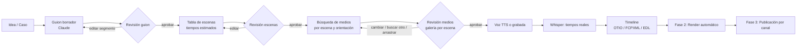
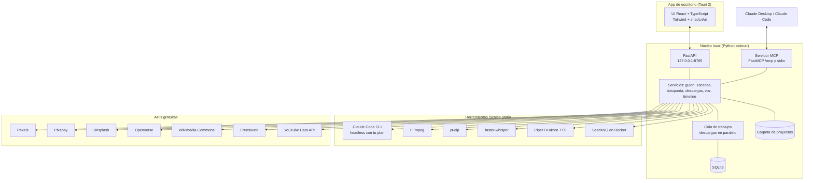

# Guionaria — Especificación de la aplicación de escritorio para producción de videos

> Nombre definitivo: **Guionaria**. Documento pensado para dárselo a **Claude Code** como contexto inicial del proyecto.
> Las capturas de referencia visual están en `docs/ui-reference/` (ver sección 15).

---

## 0. Resumen en una línea

Aplicación de escritorio **local, 100 % con herramientas gratuitas**, que convierte una idea en un video listo para editar/publicar: **guion → aprobación → tabla de escenas con tiempos → búsqueda y descarga de imágenes/videos (horizontal o vertical) → aprobación de medios → voz y tiempos reales → línea de tiempo exportable → (fase futura) render y publicación automática**, organizado por **canal** y controlable también desde **Claude vía MCP**.

---

## 1. Principios del producto

1. **Guion primero (script-first).** Nada se busca ni se descarga hasta que el guion está aprobado. Cambiar el guion propaga los cambios hacia escenas, tiempos y medios.
2. **Aprobación humana en cada etapa.** Guion, escenas y medios tienen estado `borrador → en revisión → aprobado`.
3. **Todo gratis.** Sin servicios de pago. Donde un servicio tenga límites gratuitos (Pexels, YouTube API), la app los respeta y cachea.
4. **Local-first.** Todo vive en tu disco (SQLite + carpetas). Sin nube obligatoria.
5. **Formato definido al inicio.** Cada proyecto se crea como **Video (16:9)** o **Reel/Short (9:16)** y eso filtra toda búsqueda de medios.
6. **Nunca bloquear al usuario.** Si una descarga falla, la app ofrece: abrir en navegador, arrastrar el archivo, pegar desde portapapeles o buscar alternativa.
7. **Trazabilidad.** Cada medio guarda su URL de origen, proveedor, licencia y autor (para créditos y reclamos).
8. **Claude como cerebro, la app como motor.** Claude genera y ajusta textos; la app ejecuta (buscar, descargar, renombrar, organizar, exportar).

---

## 2. Flujo de trabajo completo



### Estados del proyecto (máquina de estados)

| Estado | Qué significa | Siguiente acción |
|---|---|---|
| `IDEA` | Solo título/tema/notas | Generar guion |
| `GUION_BORRADOR` | Claude generó guion | Revisar / editar / aprobar |
| `GUION_APROBADO` | Guion bloqueado | Generar escenas |
| `ESCENAS_BORRADOR` | Tabla generada | Revisar / aprobar |
| `ESCENAS_APROBADAS` | Tabla bloqueada | Buscar medios |
| `MEDIOS_EN_REVISION` | Candidatos descargados | Elegir / reemplazar |
| `MEDIOS_APROBADOS` | Cada escena tiene su medio final | Generar voz |
| `VOZ_LISTA` | Audio + tiempos reales | Exportar timeline |
| `TIMELINE_LISTO` | Proyecto exportado a editor | Render (fase 2) |
| `RENDERIZADO` | MP4 final | Publicar (fase 3) |
| `PROGRAMADO` / `PUBLICADO` | En cola o ya subido | Analítica |

**Regla de propagación:** si editas un segmento del guion estando en un estado posterior, solo las escenas vinculadas a ese segmento vuelven a `BORRADOR`, se recalculan sus tiempos y sus medios quedan marcados como `REVISAR`. El resto del proyecto se conserva.

---

## 3. Arquitectura



### Stack elegido (todo gratuito / open source)

| Capa | Tecnología | Por qué |
|---|---|---|
| Shell de escritorio | **Tauri 2** | Binario liviano (~10 MB vs ~150 MB de Electron), multiplataforma, soporta "sidecars" (lanzar el núcleo Python empaquetado). |
| UI | **React 18 + TypeScript + Vite** | Ecosistema grande, fácil de replicar el diseño de referencia. |
| Estilos / componentes | **Tailwind CSS + shadcn/ui + lucide-react** (iconos) | Tema oscuro personalizado con tokens; iconografía de línea igual a las referencias. |
| Estado / datos | **TanStack Query + Zustand** | Cache de peticiones al núcleo y estado de UI. |
| Tablas | **TanStack Table** | Tabla de escenas editable, ordenable, con virtualización. |
| Drag & drop | **dnd-kit** + eventos nativos de Tauri (`onDragDropEvent`) | Reordenar escenas y recibir archivos/URLs arrastrados. |
| Editor de guion | **TipTap** (ProseMirror) | Edición por segmentos con IDs estables, comentarios y resaltado. |
| Reproductor | `<video>`/`<audio>` HTML5 + **wavesurfer.js** | Previsualizar clips y forma de onda de la voz. |
| Núcleo | **Python 3.12 + FastAPI + Uvicorn** | Mejor ecosistema de medios (whisper, yt-dlp, ffmpeg, Pillow). |
| MCP | **FastMCP** (SDK oficial de Python) | Mismo código de servicios expuesto como herramientas MCP. |
| ORM / BD | **SQLModel + SQLite** (+ FTS5 para búsqueda de texto) | Un archivo, sin servidor, búsqueda full-text de guiones. |
| Migraciones | **Alembic** | Evolución del esquema. |
| HTTP | **httpx** (async) | Descargas en paralelo con reintentos. |
| Cola de trabajos | `asyncio` + tabla `jobs` en SQLite | Sin Redis; suficiente para uso personal. |
| Medios | **FFmpeg, Pillow, imagehash, yt-dlp** | Miniaturas, recortes, conversión, deduplicado, descarga de video. |
| Transcripción | **faster-whisper** (modelo `small`/`medium`, CPU o GPU) | Timestamps por palabra, gratis y local. |
| Voz (TTS) | **Piper** o **Kokoro** (local) | Voces en español gratis y offline. |
| LLM | **Claude Code CLI** (tu plan actual) | Sin API key. Único proveedor de IA (Ollama descartado). |
| Empaquetado núcleo | **PyInstaller** → sidecar de Tauri | Un solo instalador para el usuario final. |
| Búsqueda web | **SearXNG** autoalojado (Docker) | Metabuscador gratis con salida JSON, incluye imágenes. |

> Alternativa considerada: núcleo en Java/Spring Boot. Se descarta para el núcleo porque whisper, yt-dlp y Pillow son nativos de Python; Java agregaría puentes a procesos externos sin beneficio.

### Procesos en ejecución

1. Tauri inicia y lanza el sidecar `guionaria-core` (FastAPI en `127.0.0.1:8765`, solo localhost).
2. La UI consume `http://127.0.0.1:8765/api/*` y recibe progreso por **WebSocket** (`/ws/jobs`).
3. El mismo proceso expone MCP por HTTP en `http://127.0.0.1:8765/mcp` y existe un entrypoint stdio `guionaria-core mcp` para Claude Desktop.
4. SearXNG corre aparte en Docker (`http://127.0.0.1:8888`); la app detecta si no está y lo indica en Ajustes.

---

## 4. Integración con Claude (sin API key)

### 4.1 Claude dentro de la app → Claude Code CLI en modo headless

La app llama a la CLI como proceso hijo y usa tu suscripción:

```bash
claude -p "<prompt>" --output-format json --max-turns 1
```

- Se ejecuta con `cwd` = carpeta del proyecto, para que Claude pueda leer `guion.md` y `escenas.json` si hace falta.
- La salida JSON trae el texto en el campo `result`; el núcleo lo valida con **Pydantic** contra el esquema esperado (sección 11). Si no valida, reintenta una vez con el error adjunto.
- Todos los prompts viven en `prompts/*.md` versionados y editables desde Ajustes.
- Proveedor único: `claude-cli`. Ollama u otros LLM locales quedan descartados por decisión del proyecto.

> Revisar en docs.claude.com los términos vigentes para uso automatizado de la suscripción antes de producción.

### 4.2 Claude fuera de la app → Servidor MCP

Permite pedirle a Claude, desde Claude Desktop o Claude Code: *"Crea un proyecto reel para el canal Casos Reales sobre X, genera el guion y busca medios"*, y la app lo ejecuta.

Registro en Claude Code:

```bash
claude mcp add --transport http guionaria http://127.0.0.1:8765/mcp
```

Registro en Claude Desktop (`claude_desktop_config.json`):

```json
{
  "mcpServers": {
    "guionaria": {
      "command": "C:\\Program Files\\Guionaria\\guionaria-core.exe",
      "args": ["mcp"]
    }
  }
}
```

Herramientas MCP en la sección 12.

---

## 5. Módulos funcionales

### 5.1 Canales
- CRUD de canales: nombre, plataforma(s) (YouTube, TikTok, Instagram, Facebook), idioma, nicho, avatar.
- **Kit de marca por canal:** colores, tipografías, intro/outro, marca de agua, plantilla de miniatura, voz TTS por defecto, velocidad de narración, duración objetivo, tono del guion (instrucciones de estilo para Claude).
- **Plantilla de guion por canal:** estructura (gancho, contexto, desarrollo, giro, cierre, CTA), duración, reglas ("no mostrar sangre", "citar fuentes").
- Métricas del canal (fase 3, YouTube Analytics API).

### 5.2 Proyectos (videos / casos)
- Crear proyecto: **canal**, **tipo (Video 16:9 | Reel/Short 9:16)**, título tentativo, tema/caso, fuentes/notas de investigación, duración objetivo.
- Vista principal tipo lista + detalle (ver referencia 03): a la izquierda las etapas del proyecto con su tamaño/progreso, a la derecha el contenido de la etapa.
- **Barra inferior fija** (referencia 01/03): "Escenas aprobadas 17/24 · Medios pendientes 5" + selector de acción + botón principal (`Aprobar guion`, `Buscar medios`, `Exportar timeline`).
- Etiquetas, prioridad, fecha objetivo de publicación, estado.
- Duplicar proyecto (p. ej. convertir un video largo en 3 reels).
- Búsqueda global (FTS5) por título, guion, etiquetas, canal.

### 5.3 Editor de guion
- Claude genera el guion a partir de: tema + notas + plantilla del canal + tipo (video/reel) + duración.
- El guion se divide en **segmentos** (una o dos frases) con ID estable (`seg_001`…). Cada segmento muestra: texto, duración estimada, escenas vinculadas.
- Acciones por segmento (menú contextual o selección de texto):
  - Editar manualmente.
  - **"Reescribir con Claude"** con instrucción ("más dramático", "más corto", "agrega dato").
  - Dividir / unir segmentos.
  - Marcar como "requiere verificación de dato".
- **Versionado:** cada guardado crea una versión (`script_versions`); vista diff entre versiones; restaurar.
- **Estimación de duración** antes de tener voz: palabras / velocidad del canal (por defecto 2,5 palabras/s en español).
- Contador en vivo: duración total vs objetivo (verde/ámbar/rojo).
- Botón **Aprobar guion** → bloquea edición directa (se puede desbloquear; al hacerlo se aplica la regla de propagación).
- Generación de extras con Claude: 5 títulos, descripción SEO, etiquetas, texto para miniatura, capítulos, primer comentario fijado.

### 5.4 Tabla de escenas (desglose)
Equivalente a la tabla que hoy haces a mano, pero editable y conectada:

| Columna | Detalle |
|---|---|
| # | Orden (arrastrable) |
| Inicio–Fin | Estimado → luego real con Whisper |
| Narración | Texto del segmento (vinculado) |
| Tipo de medio | `video` · `imagen` · `real` (material del caso) · `texto` (pantalla con texto) · `negro` |
| Descripción visual | Qué debe verse ("toma aérea de CDMX de día, zoom lento") |
| Búsqueda EN | Consulta en inglés para stock ("mexico city aerial") |
| Búsqueda alternativa | Segunda consulta si la primera no da resultados |
| Búsqueda ES / real | Consulta para material real ("Priscila Loera Franco foto") |
| Efecto | `zoom_lento_in`, `zoom_lento_out`, `ken_burns`, `estatica`, `fundido_negro`, `glitch`, `camara_rapida`, `ninguno` |
| Texto en pantalla | Opcional ("SIN JUSTICIA") |
| SFX | `static glitch`, `cinematic impact`, `typewriter`… |
| Música | Cambio de pista / intensidad |
| Medio asignado | Miniatura del medio aprobado |
| Estado | `pendiente` · `candidatos` · `aprobado` · `manual` · `revisar` |

- Generada por Claude desde el guion aprobado (JSON validado, sección 11).
- Edición en celda, reordenar, dividir escena, duplicar, eliminar.
- Filtros por estado y tipo (tabs como referencia 04: *Todas 24 · Video 10 · Imagen 8 · Real 4 · Texto 2*).
- Exportar tabla a Markdown/CSV/PDF (para trabajar fuera de la app).

### 5.5 Buscador de medios
- Por escena, lanza en paralelo la búsqueda a los proveedores según el tipo:
  - `video`/`imagen` → Pexels, Pixabay, Unsplash (solo imágenes), Openverse.
  - `real` → SearXNG (imágenes web), Wikimedia Commons, Openverse; video real mediante URL + yt-dlp.
- **Filtro de orientación automático** según el tipo de proyecto: 16:9 → `landscape`/`horizontal`; 9:16 → `portrait`/`vertical`. Opción "incluir otras orientaciones" (se recortarán).
- Filtros extra: duración mínima/máxima del clip, resolución mínima, proveedor, licencia, color dominante.
- **Buscar de nuevo** con otra consulta escrita a mano o **"Sugerir otras búsquedas con Claude"** (3 consultas alternativas).
- **Paginación / "mostrar más"** para ver otros resultados.
- Cache de búsquedas (misma consulta + orientación = no gastar cuota).

### 5.6 Revisión de medios (galería por escena)
Pantalla clave. Layout de lista + detalle (referencia 03):
- Izquierda: lista de escenas con estado y miniatura del medio elegido.
- Derecha: cuadrícula de candidatos de la escena seleccionada, con **checkbox** para marcar cuáles descargar (varios permitidos: uno principal y alternos).
- Cada tarjeta: miniatura (hover = reproducir preview de video), proveedor, resolución, duración, orientación, licencia, autor.
- **Vista grande** al hacer clic: imagen real en tamaño completo o video reproducible, con metadatos y botones:
  - `Descargar` · `Descargar y aprobar`
  - `Abrir en navegador` (URL de la página de origen)
  - `Copiar URL` · `Mostrar en carpeta` (si ya está descargado)
- Si la descarga falla (bloqueo, 403, marca de agua, baja resolución): la tarjeta pasa a estado **"Manual"** con botones `Abrir en navegador` y una **zona de arrastre** para soltar el archivo que descargues tú.
- Acciones sobre el medio aprobado: `Cambiar`, `Ver otros`, `Recortar/encuadre` (elegir el área visible en 16:9 o 9:16), `Marcar recorte de tiempo` (inicio/fin del clip), `Quitar`.
- Barra inferior: "Seleccionados 12 medios · 340 MB" + `Descargar seleccionados` / `Aprobar escena`.

### 5.7 Arrastrar y soltar / portapapeles
- Zona global y zona por escena. Acepta:
  - **Archivos** locales (imagen/video/audio).
  - **Imagen arrastrada desde el navegador** (llega como archivo o como URL `text/uri-list` / `text/html` con ``): la app extrae la URL de la imagen y la descarga.
  - **URL de página** (YouTube, noticia, etc.): la app ofrece "descargar video con yt-dlp", "capturar imagen principal (og:image)" o "guardar como referencia".
  - **Ctrl+V** con imagen en el portapapeles.
- Al soltar, la app pregunta (o asigna directamente si se soltó sobre una escena) a qué escena pertenece, y lo procesa: renombra, genera miniatura, calcula hash, registra origen como `manual` con la URL si existe.

### 5.8 Descargas y procesamiento
- Cola con progreso (referencia 02 como estilo de barras): paralelismo configurable (por defecto 4).
- Para video de stock elige la variante más cercana a la resolución destino (1080p) para no bajar 4K innecesario.
- Reintentos con backoff; cabeceras `User-Agent`/`Referer` razonables; si la original falla, intenta la miniatura grande y la marca como "baja resolución".
- Post-proceso automático: miniatura (FFmpeg), duración, resolución, orientación, **hash perceptual** (imagehash) para detectar duplicados entre proyectos, conversión a formatos estándar (JPG/PNG, MP4 H.264).
- **Renombrado automático** según la convención (sección 9).

### 5.9 Voz y tiempos reales
- Opción A: grabas tu voz (importar WAV/MP3).
- Opción B: TTS local gratis (Piper o Kokoro) con la voz del canal; generación por segmento para poder regenerar solo uno.
- **faster-whisper** transcribe con timestamps por palabra → se alinean con los segmentos → la tabla de escenas actualiza `inicio/fin` reales.
- Visualización de forma de onda con marcadores de escena (wavesurfer.js).
- Exporta subtítulos **SRT/VTT** (para YouTube y para quemar en reels).

### 5.10 Timeline y exportación al editor
- Genera la línea de tiempo con: pista de voz, pista de video (medios en orden y duración), pista de texto, pista de SFX, pista de música.
- Formatos de salida:
  - **OpenTimelineIO (.otio)** → importable en DaVinci Resolve (gratis).
  - **FCPXML** (vía adaptador de OTIO) → Resolve / Final Cut.
  - **EDL** como respaldo.
  - **Paquete del proyecto**: carpeta con todo + `LEEME.txt` con tabla de escenas, efectos y SFX por tiempo.
- Proyecto base de Resolve por canal (plantilla con presets de efectos) documentado en Ajustes.

### 5.11 Biblioteca
- Todos los medios descargados de todos los proyectos, con vista tabla (referencia 04) y vista cuadrícula.
- Filtros por tipo, canal, proyecto, proveedor, licencia, orientación, fecha, etiquetas.
- **Reutilizar** un medio en otro proyecto (sin duplicar archivo).
- Análisis de espacio por canal/proyecto con **treemap** (referencia 05) y limpieza de candidatos no usados ("Liberar 2,3 GB de medios descartados").

### 5.12 SFX y música
- Biblioteca local etiquetada (static, impact, typewriter, whoosh, drone grave, riser…).
- Búsqueda en **Freesound API** (gratis) y descarga de previews HQ; importación manual de packs gratuitos.
- Música: carpeta local (p. ej. descargada manualmente de la Biblioteca de audio de YouTube), etiquetada por mood/BPM.

### 5.13 Calendario y planificación
- Calendario mensual/semanal por canal con proyectos por fecha objetivo.
- **Tablero kanban** por estado del proyecto (arrastrar tarjetas).
- Banco de ideas por canal (con prioridad y notas), convertible a proyecto con un clic.
- Recordatorios locales (notificaciones del sistema vía Tauri).

### 5.14 Publicación (fase 3)
- Cola de publicación por canal y plataforma con estado (referencia 06: lista con toggles "publicar en…").
- Metadatos por plataforma: título, descripción, etiquetas, miniatura, visibilidad, fecha programada, playlist, subtítulos.

### 5.15 Historial y registro
- Historial de operaciones (qué se generó, descargó, borró, publicó) con posibilidad de deshacer eliminaciones (papelera 30 días).
- Registro de derechos: por proyecto, lista exportable de fuentes y créditos para la descripción del video.

### 5.16 Ajustes
- Rutas (carpeta raíz de proyectos), proveedor LLM (Claude CLI), claves gratuitas (Pexels, Pixabay, Unsplash, Freesound), URL de SearXNG, modelo Whisper, voces TTS, paralelismo, idioma de UI, tema.
- Estado de dependencias con verificación (`ffmpeg`, `yt-dlp`, `claude`, Docker/SearXNG) y botón "Cómo instalar".
- Editor de prompts.
- Copia de seguridad / restauración (BD + configuración).

---

## 6. Reel vs video normal

| | Video (horizontal) | Reel / Short (vertical) |
|---|---|---|
| Relación | 16:9 | 9:16 |
| Resolución destino | 1920×1080 | 1080×1920 |
| Duración típica | 8–20 min | 15–90 s |
| Filtro Pexels | `orientation=landscape` | `orientation=portrait` |
| Filtro Pixabay (imágenes) | `orientation=horizontal` | `orientation=vertical` |
| Filtro Unsplash | `orientation=landscape` | `orientation=portrait` |
| Pixabay video / Openverse / SearXNG | Filtrar por ancho > alto | Filtrar por alto > ancho |
| Medio en otra orientación | Recorte guiado o fondo desenfocado | Recorte guiado o fondo desenfocado |
| Subtítulos | Opcionales | Quemados, grandes, centrados |
| Plantilla guion | Estructura larga con capítulos | Gancho en 2 s, ritmo rápido, CTA corto |

---

## 7. Fuentes de medios gratuitas

| Proveedor | Tipo | Requiere | Orientación | Notas |
|---|---|---|---|---|
| **Pexels API** | Fotos y videos stock | API key gratis | Parámetro nativo | Licencia Pexels (uso libre, atribución apreciada). Respetar límites por hora/mes. |
| **Pixabay API** | Fotos, ilustraciones, videos | API key gratis | Nativo en imágenes; en video por dimensiones | Cachear resultados (lo piden sus términos). |
| **Unsplash API** | Fotos | Access key gratis | Parámetro nativo | Límite bajo en modo demo; exige atribución y registrar descargas. |
| **Openverse API** | Imágenes con licencias CC | Sin key (con límite) | Por dimensiones | Devuelve licencia y autor. |
| **Wikimedia Commons API** | Fotos reales, históricas, lugares, personas públicas | Sin key | Por dimensiones | Licencias libres; guardar atribución. |
| **SearXNG** (autoalojado) | Imágenes web (Google, Bing, DuckDuckGo…) | Docker | Por dimensiones | Activar formato `json` en `settings.yml`. Material con derechos: usar con criterio. |
| **yt-dlp** | Video desde URL (noticias, YouTube, redes) | Local | — | Solo fragmentos, con comentario y crédito. |
| **Freesound API** | Efectos de sonido | Key gratis | — | Licencias CC por archivo. |
| Descarga manual | Cualquier cosa | — | — | Arrastrar/pegar en la app. |

> Validar los límites vigentes de cada API al implementar; guardarlos en configuración, no en código.

---

## 8. Estructura de carpetas en disco

```
Guionaria/
├── guionaria.db
├── config/
│   ├── settings.json
│   └── prompts/
│       ├── guion.md
│       ├── escenas.md
│       ├── reescribir_segmento.md
│       ├── busquedas_alternativas.md
│       └── metadatos_publicacion.md
├── library/
│   ├── sfx/
│   └── music/
└── channels/
    └── casos-reales/
        ├── brand/                 # logo, intro, outro, fuentes, plantilla miniatura
        └── projects/
            └── 2026-09-25_priscila-loera-franco_video/
                ├── project.json   # snapshot legible del proyecto
                ├── guion.md       # versión aprobada
                ├── escenas.json
                ├── escenas.md     # tabla exportada
                ├── media/
                │   ├── approved/
                │   ├── candidates/
                │   └── manual/
                ├── audio/
                │   ├── voz.wav
                │   └── segments/
                ├── subs/voz.srt
                ├── timeline/proyecto.otio
                ├── timeline/proyecto.fcpxml
                ├── render/        # fase 2
                └── creditos.txt
```

---

## 9. Convención de nombres de archivos

```
{escena:03d}_{inicio_mmss}_{tipo}_{slug}[_{variante}].{ext}
```

Ejemplos:

```
004_0100_real_priscila-loera-franco.jpg
005_0105_video_mexico-city-night-aerial.mp4
005_0105_video_mexico-city-night-aerial_alt1.mp4
011_0130_texto_sin-justicia.png
```

- `slug`: consulta o descripción en minúsculas, sin tildes, guiones, máx. 40 caracteres.
- Al reordenar escenas o actualizar tiempos reales, la app **renombra automáticamente** los archivos aprobados (operación transaccional con registro en historial).
- Candidatos: `candidates/{escena:03d}_{proveedor}_{id}.{ext}`.

---

## 10. Modelo de datos (SQLite)

```sql
CREATE TABLE channel (
  id INTEGER PRIMARY KEY,
  name TEXT NOT NULL,
  slug TEXT UNIQUE NOT NULL,
  platforms TEXT NOT NULL,            -- JSON: ["youtube","tiktok"]
  language TEXT DEFAULT 'es',
  niche TEXT,
  style_prompt TEXT,                  -- tono/reglas para Claude
  script_template TEXT,               -- estructura del guion
  words_per_second REAL DEFAULT 2.5,
  default_voice TEXT,
  brand_json TEXT,                    -- colores, fuentes, intro/outro
  created_at TEXT, updated_at TEXT
);

CREATE TABLE project (
  id INTEGER PRIMARY KEY,
  channel_id INTEGER NOT NULL REFERENCES channel(id),
  title TEXT NOT NULL,
  slug TEXT NOT NULL,
  format TEXT NOT NULL CHECK (format IN ('video','reel')),
  status TEXT NOT NULL,
  topic TEXT, research_notes TEXT,
  target_duration_s INTEGER,
  target_publish_at TEXT,
  priority INTEGER DEFAULT 2,
  tags TEXT,                          -- JSON
  folder_path TEXT NOT NULL,
  parent_project_id INTEGER REFERENCES project(id),  -- reels derivados
  created_at TEXT, updated_at TEXT
);

CREATE TABLE script_version (
  id INTEGER PRIMARY KEY,
  project_id INTEGER NOT NULL REFERENCES project(id),
  version INTEGER NOT NULL,
  status TEXT NOT NULL,               -- draft | approved | superseded
  source TEXT,                        -- claude | manual
  created_at TEXT
);

CREATE TABLE segment (
  id INTEGER PRIMARY KEY,
  script_version_id INTEGER NOT NULL REFERENCES script_version(id),
  seg_key TEXT NOT NULL,              -- estable entre versiones: seg_001
  position INTEGER NOT NULL,
  section TEXT,                       -- gancho, contexto, desarrollo...
  text TEXT NOT NULL,
  text_hash TEXT NOT NULL,            -- detectar cambios para propagación
  est_duration_s REAL,
  needs_fact_check INTEGER DEFAULT 0
);

CREATE TABLE scene (
  id INTEGER PRIMARY KEY,
  project_id INTEGER NOT NULL REFERENCES project(id),
  seg_key TEXT NOT NULL,
  position INTEGER NOT NULL,
  start_s REAL, end_s REAL,
  timing_source TEXT DEFAULT 'estimated',  -- estimated | whisper | manual
  narration TEXT,
  media_kind TEXT NOT NULL,           -- video | image | real | text | black
  visual_description TEXT,
  query_en TEXT, query_alt TEXT, query_real TEXT,
  effect TEXT, on_screen_text TEXT,
  sfx TEXT, music_cue TEXT,
  status TEXT NOT NULL,               -- pending|candidates|approved|manual|review
  approved_asset_id INTEGER REFERENCES asset(id)
);

CREATE TABLE asset (
  id INTEGER PRIMARY KEY,
  kind TEXT NOT NULL,                 -- image | video | audio
  file_path TEXT NOT NULL,
  thumb_path TEXT,
  provider TEXT NOT NULL,             -- pexels|pixabay|unsplash|openverse|wikimedia|searxng|ytdlp|manual|tts
  provider_id TEXT,
  source_page_url TEXT,
  source_file_url TEXT,
  author TEXT, license TEXT,
  width INTEGER, height INTEGER, duration_s REAL,
  orientation TEXT,                   -- landscape | portrait | square
  size_bytes INTEGER,
  phash TEXT,
  low_res INTEGER DEFAULT 0,
  created_at TEXT
);

CREATE TABLE scene_candidate (
  id INTEGER PRIMARY KEY,
  scene_id INTEGER NOT NULL REFERENCES scene(id),
  provider TEXT NOT NULL,
  provider_id TEXT,
  preview_url TEXT, full_url TEXT, page_url TEXT,
  width INTEGER, height INTEGER, duration_s REAL,
  license TEXT, author TEXT,
  query TEXT,
  selected INTEGER DEFAULT 0,
  download_status TEXT DEFAULT 'none', -- none|queued|downloading|done|failed|manual
  asset_id INTEGER REFERENCES asset(id),
  error TEXT
);

CREATE TABLE scene_asset (             -- aprobado + alternos, con recortes
  scene_id INTEGER REFERENCES scene(id),
  asset_id INTEGER REFERENCES asset(id),
  role TEXT DEFAULT 'main',            -- main | alt
  crop_json TEXT,                      -- encuadre para 16:9 / 9:16
  trim_in_s REAL, trim_out_s REAL,
  PRIMARY KEY (scene_id, asset_id)
);

CREATE TABLE voice_track (
  id INTEGER PRIMARY KEY,
  project_id INTEGER REFERENCES project(id),
  source TEXT,                         -- recorded | piper | kokoro
  file_path TEXT, duration_s REAL,
  transcript_json TEXT,                -- palabras con timestamps
  created_at TEXT
);

CREATE TABLE job (
  id INTEGER PRIMARY KEY,
  type TEXT NOT NULL,                  -- generate_script|generate_scenes|search|download|tts|transcribe|export|render|publish
  project_id INTEGER,
  payload TEXT, status TEXT, progress REAL,
  error TEXT, created_at TEXT, finished_at TEXT
);

CREATE TABLE search_cache (
  key TEXT PRIMARY KEY,                -- provider+query+orientation+page
  response TEXT, created_at TEXT
);

CREATE TABLE publication (
  id INTEGER PRIMARY KEY,
  project_id INTEGER REFERENCES project(id),
  platform TEXT, account TEXT,
  title TEXT, description TEXT, tags TEXT,
  thumbnail_path TEXT, visibility TEXT,
  scheduled_at TEXT, published_at TEXT,
  external_id TEXT, external_url TEXT,
  status TEXT, error TEXT
);

CREATE TABLE idea (
  id INTEGER PRIMARY KEY,
  channel_id INTEGER REFERENCES channel(id),
  title TEXT, notes TEXT, priority INTEGER, status TEXT, created_at TEXT
);

CREATE TABLE operation_log (
  id INTEGER PRIMARY KEY,
  at TEXT, actor TEXT,                 -- ui | mcp | system
  action TEXT, entity TEXT, entity_id INTEGER, details TEXT
);

CREATE VIRTUAL TABLE project_fts USING fts5(title, topic, script_text, tags);
```

---

## 11. Contratos JSON (salidas de Claude validadas)

### 11.1 Guion

```json
{
  "titulo_tentativo": "El secuestro más largo de Ciudad de México",
  "duracion_objetivo_s": 600,
  "segmentos": [
    { "seg_key": "seg_001", "seccion": "gancho", "texto": "Esto no es una película.", "verificar_dato": false },
    { "seg_key": "seg_002", "seccion": "gancho", "texto": "Esto le pasó a una familia real…", "verificar_dato": false }
  ],
  "fuentes_sugeridas": ["..."]
}
```

### 11.2 Escenas

```json
{
  "formato": "video",
  "escenas": [
    {
      "seg_key": "seg_001",
      "orden": 1,
      "tipo": "real",
      "descripcion_visual": "2 segundos del video real del secuestro con estática y corte a negro",
      "busqueda_en": "",
      "busqueda_alt": "",
      "busqueda_real": "video secuestro Priscila Loera Franco noticia",
      "efecto": "estatica",
      "texto_pantalla": "",
      "sfx": "static glitch",
      "musica": ""
    },
    {
      "seg_key": "seg_002",
      "orden": 2,
      "tipo": "video",
      "descripcion_visual": "Toma aérea de Ciudad de México de día, zoom lento",
      "busqueda_en": "mexico city aerial",
      "busqueda_alt": "city skyline drone day",
      "busqueda_real": "",
      "efecto": "zoom_lento_in",
      "texto_pantalla": "",
      "sfx": "",
      "musica": "entra drone grave"
    }
  ]
}
```

Reglas de validación: `tipo` ∈ enum; `busqueda_en` obligatoria si `tipo` ∈ {video, imagen}; `busqueda_real` obligatoria si `tipo = real`; `efecto` ∈ enum; cada `seg_key` existe en el guion aprobado. Los tiempos **no** los genera Claude: los calcula la app.

---

## 12. Servidor MCP — herramientas

| Herramienta | Entrada | Salida |
|---|---|---|
| `list_channels` | — | canales |
| `create_project` | channel, title, format (video/reel), topic, notes, target_duration_s | project_id |
| `list_projects` | channel?, status?, query? | proyectos |
| `get_project` | project_id | proyecto + estado + resumen |
| `save_script` | project_id, segmentos[] | script_version |
| `get_script` | project_id, version? | guion |
| `update_segment` | project_id, seg_key, texto | escenas afectadas |
| `approve_script` | project_id | ok |
| `save_scenes` | project_id, escenas[] | tabla validada |
| `update_scene` | scene_id, campos | escena |
| `approve_scenes` | project_id | ok |
| `search_media` | scene_id, query?, provider?, page? | candidatos |
| `select_candidates` | scene_id, candidate_ids[] | jobs de descarga |
| `approve_media` | scene_id, asset_id | ok |
| `list_pending` | project_id | escenas sin medio / manuales |
| `add_media_from_url` | scene_id, url | asset o job |
| `generate_voice` | project_id, engine, voice | job |
| `transcribe_voice` | project_id | tiempos reales aplicados |
| `export_timeline` | project_id, format (otio/fcpxml/edl) | rutas |
| `get_credits` | project_id | texto de créditos |
| `job_status` | job_id | progreso |

Recursos MCP (solo lectura): `guionaria://project/{id}/script`, `guionaria://project/{id}/scenes`, `guionaria://channel/{slug}/style`.

**Importante:** cuando Claude trabaja por MCP, él mismo redacta guion y escenas y los guarda con `save_script`/`save_scenes`; la app no llama a la CLI en ese caso (evita doble consumo).

---

## 13. API interna (UI ↔ núcleo)

```
GET    /api/health                      estado de dependencias
GET    /api/channels                    | POST | PATCH /{id} | DELETE /{id}
GET    /api/projects?channel=&status=&q=
POST   /api/projects
GET    /api/projects/{id}
POST   /api/projects/{id}/script:generate
PUT    /api/projects/{id}/script        guardar edición (crea versión)
POST   /api/projects/{id}/script/segments/{seg}:rewrite   {instruccion}
POST   /api/projects/{id}/script:approve
POST   /api/projects/{id}/scenes:generate
PATCH  /api/scenes/{id}
POST   /api/projects/{id}/scenes:reorder
POST   /api/projects/{id}/scenes:approve
POST   /api/scenes/{id}/search          {query?, providers?, page?, any_orientation?}
POST   /api/scenes/{id}/queries:suggest
POST   /api/scenes/{id}/candidates:download   {candidate_ids}
POST   /api/scenes/{id}/assets          multipart (drag & drop) o {url}
POST   /api/scenes/{id}/assets/{asset}:approve  {crop?, trim?}
POST   /api/projects/{id}/voice:generate
POST   /api/projects/{id}/voice:upload
POST   /api/projects/{id}/voice:transcribe
POST   /api/projects/{id}/timeline:export {format}
GET    /api/library?kind=&channel=&provider=&orientation=
GET    /api/storage/usage               datos del treemap
POST   /api/storage/cleanup
GET    /api/jobs | WS /ws/jobs
GET    /api/history
```

---

## 14. Prompts base (editables)

**guion.md**
```
Eres guionista del canal "{canal}". Estilo: {style_prompt}.
Formato: {formato} ({duracion_objetivo_s} s, ~{palabras_objetivo} palabras).
Estructura: {script_template}.
Tema: {tema}
Notas de investigación: {notas}
Reglas: frases cortas, una idea por frase, no inventes datos; marca verificar_dato=true si un dato no está en las notas.
Responde SOLO con JSON válido según este esquema: {schema_guion}
```

**escenas.md**
```
Convierte este guion aprobado en escenas para un {formato} ({relacion}).
Cada segmento puede tener 1 o más escenas; ninguna escena dura más de {max_escena_s} s.
tipo: "real" solo para material específico del caso (fotos de personas, lugares exactos, noticias);
"video"/"imagen" para planos genéricos de stock; "texto" para pantallas con texto.
busqueda_en: en inglés, 2–4 palabras, genérica, pensando en bancos de stock.
Efectos permitidos: {lista_efectos}. SFX de la biblioteca: {lista_sfx}.
Responde SOLO con JSON válido según: {schema_escenas}
Guion: {guion_json}
```

**reescribir_segmento.md**, **busquedas_alternativas.md**, **metadatos_publicacion.md**: misma estructura, salida JSON.

---

## 15. Guía de interfaz (basada en las referencias)

Las capturas de `docs/ui-reference/` son **referencia de estilo y patrones de layout**, no de contenido. Construir componentes propios con el mismo lenguaje visual; no copiar marca, logo ni textos de esa aplicación.

### 15.1 Tokens de diseño (aproximados de las capturas)

```css
:root {
  --bg-app:        #15110f;   /* fondo ventana */
  --bg-sidebar:    #1a1512;
  --bg-panel:      #1d1815;   /* tarjetas / paneles */
  --bg-panel-2:    #241d19;   /* hover / fila activa */
  --bg-active:     #3a2415;   /* ítem de menú activo (marrón anaranjado) */
  --border:        #2e2621;
  --text:          #efe8e3;
  --text-muted:    #a39890;
  --text-subtle:   #7d726b;
  --accent:        #ff7a1a;   /* naranja principal */
  --accent-hover:  #ff8c3a;
  --accent-fg:     #1a0f08;
  --success-bg:    #1f3a2a;   /* badge "bajo riesgo" */
  --success-fg:    #7ddc9a;
  --warning:       #f5b53d;
  --danger:        #ef5a4c;
  --radius-sm: 6px; --radius-md: 10px; --radius-lg: 14px;
  --font-ui: "Inter", system-ui, sans-serif;
  --font-num: "JetBrains Mono", monospace;   /* cifras destacadas */
}
```

Tipografía: títulos de página 22–24 px regular; números clave (duración, GB, conteos) en naranja y más grandes; secundarios en gris.

### 15.2 Patrones de layout y dónde usarlos

| Referencia | Patrón | Pantalla de Guionaria |
|---|---|---|
| `01`, `03` | Sidebar + lista de categorías + panel de detalle con checkboxes + barra inferior con resumen y botón naranja | **Proyecto**: etapas a la izquierda (Guion, Escenas, Medios, Voz, Timeline, Publicación) y detalle a la derecha. **Revisión de medios**: escenas a la izquierda, candidatos a la derecha. |
| `02` | Filas comparativas con barras de progreso | **Cola de descargas/trabajos** y comparación de duración estimada vs real por sección del guion. |
| `04` | Tabla con tabs de filtro con contador, columnas ordenables, checkbox por fila, barra inferior con acción destructiva | **Tabla de escenas** y **Biblioteca de medios**. |
| `05` | Navegación breadcrumb + lista con barras de porcentaje + treemap | **Almacenamiento**: espacio por canal → proyecto → tipo de medio; limpieza de candidatos. |
| `06` | Lista con icono, título, subtítulo, contador y toggle | **Canales** (activar plataformas por canal) y **cola de publicación** (publicar en YouTube/TikTok/IG). |
| `07` | Árbol jerárquico con checkboxes tri-estado y badges de riesgo | **Revisión global**: Canal → Proyecto → Escena → Medio, con badges de estado (Aprobado / Manual / Revisar / Licencia dudosa). |

### 15.3 Navegación (sidebar)

```
PRODUCCIÓN
  ▸ Inicio (panel: pendientes, próximos a publicar)
  ▸ Proyectos
  ▸ Ideas
  ▸ Calendario
BIBLIOTECA
  ▸ Medios
  ▸ SFX y música
  ▸ Almacenamiento
CANALES
  ▸ Canales y marca
  ▸ Publicación
SISTEMA
  ▸ Historial de operaciones
  ▸ Ajustes
  ◂ Contraer barra lateral
```

Encabezado de cada pantalla: título a la izquierda; a la derecha, **selector de canal** (como el selector de disco de la referencia, con barra de progreso = % de proyectos del mes completados) y botón secundario (`Buscar de nuevo`, `Regenerar`).

### 15.4 Comportamientos de UI
- Atajos: `Ctrl+Enter` aprobar, `←/→` escena anterior/siguiente en revisión de medios, `Espacio` previsualizar, `1–9` elegir candidato, `Ctrl+V` pegar medio.
- Todo proceso largo muestra progreso en la barra inferior y en un panel de trabajos.
- Estados vacíos con acción clara ("Sin guion todavía · Generar con Claude").
- Modo oscuro por defecto; tema claro opcional.

---

## 16. Etapas siguientes

### Fase 2 — Ensamblado automático del video (todo gratis)
- Motor: **FFmpeg** (vía `ffmpeg-python`) o **MoviePy** para: escalar/recortar a 1920×1080 o 1080×1920, efectos (Ken Burns/zoom con `zoompan`, fundidos, estática superpuesta, texto con `drawtext`), mezcla de voz + música con **ducking** (`sidechaincompress`), SFX en su tiempo, subtítulos quemados (ASS) para reels.
- Alternativa avanzada: **Remotion** (React → video; gratis para uso individual, revisar su licencia) si se quieren plantillas animadas con el mismo stack de la UI.
- Salidas: MP4 H.264 + AAC, miniatura sugerida (fotograma o plantilla con Pillow).
- Render en segundo plano con barra de progreso; "render de borrador" a 720p para revisión rápida.

### Fase 3 — Publicación automática
| Plataforma | Vía gratuita | Observaciones |
|---|---|---|
| YouTube / Shorts | **YouTube Data API v3** (OAuth) | Cuota diaria gratuita limitada (subir un video consume una parte grande). Proyectos de API no verificados suben como **privado** hasta pasar la auditoría de Google. |
| Instagram Reels / Facebook | **Graph API de Meta** | Requiere cuenta profesional vinculada a una página de Facebook y app de Meta. |
| TikTok | **Content Posting API** | Requiere aprobación de la app; sin auditoría publica solo en privado. |
| Varias a la vez | **Postiz** autoalojado (open source) | Programador multicanal; la app puede enviarle los videos por su API. |

- Programación por fecha/hora por canal, reintentos, registro de URL publicada.
- **Analítica** (YouTube Analytics API): vistas, retención, CTR por video, para retroalimentar los prompts del canal.

---

## 17. Plan de desarrollo por fases

### Fase 0 — Base (1 semana)
- [x] Repo monorepo: `apps/desktop` (Tauri+React), `core/` (Python), `docs/`.
- [x] Tauri lanza sidecar Python; `/api/health`.
- [x] Tema, tokens y layout (sidebar + encabezado + barra inferior).
- [x] SQLite + Alembic + modelos.
- [x] Ajustes con verificación de dependencias.

### Fase 1 — MVP de producción (3–4 semanas)
- [x] Canales y proyectos (video/reel).
- [x] Generación de guion con Claude CLI, editor por segmentos, versiones, aprobación.
- [x] Tabla de escenas generada, editable, aprobación y propagación de cambios.
- [x] Búsqueda Pexels + Pixabay con orientación; galería de candidatos con selección múltiple.
- [x] Cola de descargas, renombrado, miniaturas.
- [x] Vista grande + "Abrir en navegador" + zona de arrastre + Ctrl+V.
- [x] Exportar `escenas.md` y paquete de carpeta.

### Fase 2 — Material real y tiempos (2–3 semanas)
- [x] SearXNG, Wikimedia, Openverse, Unsplash; yt-dlp desde URL.
- [x] TTS (Piper/Kokoro) + faster-whisper + tiempos reales + SRT. *(Piper; Kokoro queda opcional)*
- [x] Export OTIO / FCPXML / EDL.
- [x] Servidor MCP con las herramientas de la sección 12.
- [x] Recorte/encuadre y recorte de tiempo por medio.

### Fase 3 — Organización profesional (2 semanas)
- [x] Biblioteca global, deduplicado por hash, reutilización.
- [x] Almacenamiento con treemap y limpieza.
- [x] Calendario, kanban, banco de ideas.
- [x] Créditos automáticos, historial y papelera.
- [ ] SFX (Freesound) y música.

### Fase 4 — Render automático
### Fase 5 — Publicación y analítica

---

## 18. Instalación de herramientas (Windows)

```powershell
# Base
winget install Git.Git
winget install OpenJS.NodeJS.LTS
winget install Python.Python.3.12
winget install Rustlang.Rustup          # requerido por Tauri
winget install Gyan.FFmpeg
winget install Docker.DockerDesktop     # para SearXNG
npm install -g @anthropic-ai/claude-code   # verificar método de instalación vigente en docs.claude.com

# Python
pip install fastapi uvicorn[standard] sqlmodel alembic httpx pydantic \
            fastmcp faster-whisper yt-dlp pillow imagehash ffmpeg-python \
            opentimelineio piper-tts pyinstaller

# SearXNG
docker run -d --name searxng -p 8888:8080 -v searxng:/etc/searxng searxng/searxng
# luego en /etc/searxng/settings.yml -> search.formats: [html, json]

# Frontend
npm create tauri-app@latest   # React + TypeScript
npm i @tanstack/react-query @tanstack/react-table zustand @dnd-kit/core \
      @tiptap/react @tiptap/starter-kit wavesurfer.js lucide-react
npx shadcn@latest init
```

Claves gratuitas a crear: Pexels, Pixabay, Unsplash, Freesound (y más adelante Google Cloud para YouTube Data API).

---

## 19. Derechos y cumplimiento

- Guardar siempre origen, autor y licencia; generar `creditos.txt` para la descripción.
- Material real (fotos de víctimas, clips de noticias) tiene derechos: fragmentos cortos, con narración/comentario encima, citar fuente. La app marca estos medios con badge **"Derechos: revisar"**.
- Contenido de crímenes reales: revisar políticas de YouTube sobre violencia y menores (riesgo de restricción de edad o desmonetización). Añadir en la plantilla del canal reglas de tratamiento respetuoso.
- Respetar términos de cada API (cache, atribución, no redistribuir la biblioteca).
- SearXNG y yt-dlp se usan para uso personal y editorial; el usuario es responsable del uso final.

---

## 20. Riesgos y decisiones abiertas

| Tema | Riesgo | Mitigación |
|---|---|---|
| Límites del plan de Claude | Generaciones grandes consumen cuota | MCP evita doble consumo; cachear resultados. |
| Bloqueo de descargas web | 403, hotlink, marcas de agua | Estado "Manual" + abrir en navegador + drag & drop. |
| Cuotas de APIs de stock | Límites por hora | Cache SQLite, paginación bajo demanda. |
| Whisper en CPU | Lento en videos largos | Modelo `small` por defecto, `medium` opcional, GPU si existe. |
| Publicación en plataformas | Auditorías y apps aprobadas | Empezar con YouTube; Postiz como capa multicanal. |
| Tamaño en disco | Candidatos acumulados | Limpieza automática de candidatos no usados tras aprobar. |

Decisiones por confirmar: soporte macOS/Linux desde el inicio, voz propia vs TTS por canal.

---

## 21. Cómo usar este paquete con Claude Code

1. Descomprime `guionaria-spec.zip` en la carpeta raíz de tu nuevo repo.
2. Abre una terminal ahí y ejecuta `claude`.
3. Primer mensaje sugerido:

```
Lee SPEC.md completo y revisa las imágenes de docs/ui-reference/ (son referencia de estilo).
Propón la estructura del monorepo y ejecuta la Fase 0 de la sección 17.
Antes de escribir código, muéstrame el plan y los archivos que vas a crear.
```

4. Avanza fase por fase marcando los checkboxes de la sección 17.
